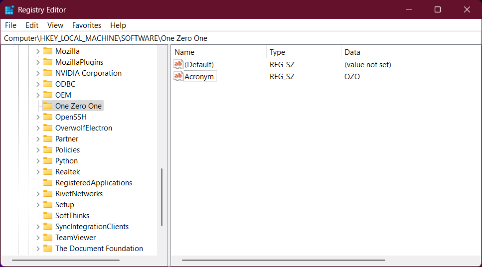

# OZORegistry PowerShell Module Installation, Usage, and Guidance
This module provides functions and classes for interacting with the Microsoft Windows Registry.

## The Registry


### Definitions

|Term|Definition|
|----|----------|
|Key|The registry is composed of _keys_ that contain zero or more _values_, and may contain other _keys_. The image above shows the `HKEY_LOCAL_MACHINE\SOFTWARE\One Zero One` _key_.|
|Value|Each key contains zero or more _values_. Within a _key_, each _value_ must be unique. The image above shows that the `One Zero One` _key_ contains the `(default)` and `Acronym` _values_.|
|Data|Each value [generally\] contains _data_, but may also be empty. The image above shows that the `Acronym` value contains the `OZO` _data_.|
|Type|Each value has a data _type_. Valid registry data types are `Binary`, `Dword`, `ExpandString`, `MultiString`, `Qword`, and `String`.

### Types in the Registry vs. PowerShell
Each registry key _value_ has a _data type_. This table details the relationship between registry _data types_ and PowerShell _data types_ to help you align the data you are reading or writing in PowerShell with the corresponding registry data.

|Registry Type|PowerShell Type|Description|
|-------------|---------------|-----------|
|Binary|Byte[]|Byte array|
|Dword|Int32|32-bit unsigned integer|
|ExpandString|String|String that will be expanded when retrieved|
|MultString|String[]|String array|
|Qword|Int64|64-bit unsigned integer|
|String|String|String|

### Paths
Registry paths are generally expressed using one of two formats, e.g.:

- `HKEY_LOCAL_MACHINE\SOFTWARE\One Zero One`
- `HKLM:\SOFTWARE\One Zero One`

Either format is acceptable for all functions in this module.

## Installation
This module is published to [PowerShell Gallery](https://learn.microsoft.com/en-us/powershell/scripting/gallery/overview?view=powershell-5.1). Ensure your system is configured for this repository then execute the following in an _Administrator_ PowerShell:

```powershell
Install-Module OZORegistry
```

## Usage
Import this module in your script or console to make the functions available for use:

```powershell
Import-Module OZORegistry
```

## Simple Functions
- [Convert-OZORegistryPath](Documentation/Convert-OZORegistryPath.md) converts a registry string from one format to another.
- [Read-OZORegistryKeyValueData](Documentation/Read-OZORegistryKeyValueData.md) is a simple function for returning the data from a single registry key value.
- [Read-OZORegistryKeyValueType](Documentation/Read-OZORegistryKeyValueType.md) is a simple function for returning the data _type_ from a single registry key value.
- [Write-OZORegistryKeyValueData](Documentation/Write-OZORegistryKeyValueData.md) is a simple function for adding or updating a single registry key value.

## Advanced Functions
- [Get-OZORegistryKey](Documentation/Get-OZORegistryKey.md) returns an `OZORegistryKey` object that represents a registry key (whether existing or not). The resulting object contains methods for reading, adding, updating, and removing key values; and a method for processing (writing) the changes to the registry. This function (and resulting object) is the most robust and flexible use of this module.

## Classes
- [OZORegistryKey](Documentation/OZORegistryKey.md)
- [OZORegistryKeyValue](Documentation/OZORegistryKeyValue.md)

## Logging
Messages as written to the Windows Event Viewer [_One Zero One_](https://github.com/onezeroone-dev/OZOLogger-PowerShell-Module/blob/main/README.md) provider when available. Otherwise, messages are written to the _Microsoft-Windows-PowerShell_ provider under event ID 4100.

## License
This module is licensed under the [GNU General Public License (GPL) version 2.0](LICENSE).

## Acknowledgements
Special thanks to my employer, [Sonic Healthcare USA](https://sonichealthcareusa.com), who supports the growth of my PowerShell skillset and enables me to contribute portions of my work product to the PowerShell community.
